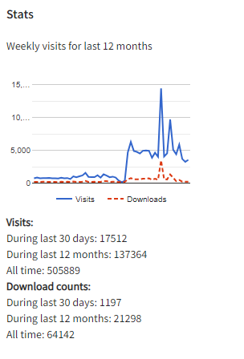
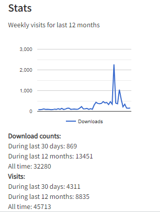

# ckanext-matomo - Matomo analytics extension


[](https://github.com/vrk-kpa/ckanext-matomo/actions)


[](https://codecov.io/gh/vrk-kpa/ckanext-matomo)

Adds matomo analytics tracking to ckan. By default only posts tracking data to configured matomo instance.


------------
Requirements
------------

Compatibility with core CKAN versions:

| CKAN version    | Compatible? |
| --------------- |-------------|
| 2.8             | not tested  |
| 2.9             | yes         |
| 2.10            | yes         |

------------
Installation
------------

To install ckanext-matomo:

1. Activate your CKAN virtual environment, for example:

```
. /usr/lib/ckan/default/bin/activate
```

2. Clone the source and install it on the virtualenv


```
    git clone https://github.com/vrk-kpa/ckanext-matomo.git
    cd ckanext-matomo
    pip install -e .
    pip install -r requirements.txt
```

3. Add ``matomo`` to the ``ckan.plugins`` setting in your CKAN
   config file (by default the config file is located at
   ``/etc/ckan/default/ckan.ini``).


4. Initialize database for local matomo data

```
     ckan -c ckan.ini db upgrade -p matomo
```

5. Restart CKAN. For example if you've deployed CKAN with uWSGI on Ubuntu:

```
     sudo supervisorctl restart all
```

# Config Settings


    # The domain used for matomo analytics
    ckanext.matomo.domain = http://example.com/

    # The site id used in matomo
    ckanext.matomo.site_id = 1

    # The domain where matomo script is downloaded
    # (optional, default ckanext.matomo.domain)
    ckanext.matomo.script_domain

    # matomo api token, required for posting api events and downloading analytics
    ckanext.matomo.token_auth = <your token here>

    # To track api events, set to true
    ckanext.matomo.track_api = true

    # To track downloads, set to true
    ckanext.matoto.track_downloads = true

    # you can disable downloads on graphs, default is true
    ckanext-matomo.show_download_graph = false

# Graphs

Dataset and resource pages can have following the graphs by adding empty blocks to ``package/read_base.html`` and ``package/resource_read.html``

```
  
  
```

Requires configuring matomo auth token:

```
  ckanext.matomo.token_auth = <your token here>
```

and running cli command to fetch the data:

```
  ckan -c ckan.ini matomo fetch
```
| Dataset page | Resource Page |
|--------------|---------------|
| | |


# Development Installation

To install ckanext-matomo for development, activate your CKAN virtualenv and do:

    git clone https://github.com/vrk-kpa/ckanext-matomo.git
    cd ckanext-matomo
    python setup.py develop
    pip install -r dev-requirements.txt


# Running the Tests

To run the tests, do:

    pytests --ckan-ini=test.ini


## License

[AGPL](https://www.gnu.org/licenses/agpl-3.0.en.html)
